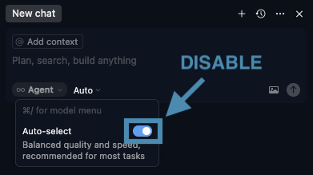
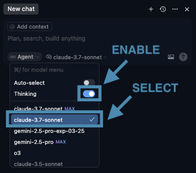

# Cursor IDE Setup Guide

This guide provides best practices for configuring [Cursor IDE](https://cursor.com/) to maximize the efficiency and accuracy of its AI-assisted coding features.

## Table of Contents

- [X] [Use a Thinking Model](#use-a-thinking-model)
- [X] [User Rules](#user-rules)
- [X] [Project Specs File](#project-specs-file)
- [X] [Setting Up MCP Servers](#setting-up-mcp-servers)
- [X] [Conclusion](#conclusion)

## Use a Thinking Model

I have found that I get significantly better results when I disable Cursors **default** "Auto-select" Agent model and use a "Thinking" model instead. While it is a bit slower, it yields more accurate results, especially when working with complex code.

This solution works well, as it instructs Cursor to generate ideas and to analyze them **before** generating any solutions. Non-thinking models, which you will likely get when you have `Auto-select` enabled, will spit out the first solution they come up with, vs. selecting the best one from the possible solutions it detected. Enabling this "Thinking" mode also allows you, as a developer, to "see" what the AI Model is considering, giving you amazing insight into how AI approaches solving your problem.

### How to Enable the Thinking Model

Open Model Selection Menu:


Disable `Auto-select` model:



Enable `Thinking` model, and choose `claude-3.7-sonnet`



## User Rules

[User Rules](https://docs.cursor.com/context/rules#user-rules) allow you to provide Global guidance to the Cursor Agent. They apply to all projects and are always included in your model context.

### Update Setting

> Cursor › Settings... › Cursor Settings › Rules › User Rules

Below is a good starter set of User Rules that have worked for most of my projects ( sorted in order of importance ):

```markdown
- Ask for clarification if feature scope or requirements are unclear.
- Only implement the functionality we’ve discussed; don’t add scaffold or demo code.
- Preserve existing comments; add new ones only to explain non-obvious logic.
- Follow existing naming conventions exactly, including case sensitivity (e.g. CONSTANT_CASE for constants, camelCase for variables, PascalCase for classes).
- Mirror the project’s coding patterns (e.g. named vs. arrow functions, module/export style) wherever possible.
- Adopt the project’s documentation style (JSDoc, docstrings, inline specs) when generating or updating code.
- Respect the project’s indentation, file organization, and lint/formatter configs (ESLint, Prettier, .editorconfig, etc.).
- Ensure all generated code compiles cleanly and passes existing linting/tests.
- Don’t duplicate functionality across files; extend or refactor existing code instead.
- Only introduce new dependencies when absolutely necessary—and after you’ve checked with the dev.
- Avoid changing build or config files (e.g. `package.json`, webpack/Vite/Next configs) unless explicitly asked.
- Follow existing UI patterns and any CSS utility classes; don’t invent new styling conventions.
- Don’t auto-generate tests unless tests are explicitly requested.
- Never leave placeholder text (e.g., TODO, lorem ipsum) in committed code.
- Keep diffs minimal and focused—avoid broad refactors or directory moves without approval.
- When modifying a file, touch only the lines needed for the requested change.
- If a file named `project-specs.md` exists at the project root, always load its contents at startup and treat it as the authoritative source for conventions, folder structure, tech choices, and design decisions.
- When you introduce or modify any convention, dependency, folder structure, or feature in code, update `project-specs.md` if it exists to reflect that change—keeping its prose concise while capturing all relevant information.
```

**NOTE**: I have noticed that Cursor does not always follow these rules, but it does most of the time. So just be on the lookout for the times Cursor gets creative.

## Project Specs File

The Cursor AI Agent cannot edit Cursor [User Rules](https://docs.cursor.com/context/rules#user-rules) or [Project Rules](https://docs.cursor.com/context/rules#project-rules), but can change a local project file. Knowing this, let's create a new file that gives Cursor more context for our project.

In the **User Rules** section above, you might have seen a file named `project-specs.md` mentioned. This custom file we are creating in the root of our project helps provide the missing context that the AI can use to help make better decisions.

When leveraging AI within Cursor, your project's context is limited, making it difficult for AI to make the correct choices. We can assist the Cursor AI Agent by providing additional context.

There are four main sections we can provide in this document that will go a long way towards helping Cursor know a bit more about our project:

1. **Project Description** – A human-readable overview of the project that explains the overall purpose and goals, written to inform an AI assistant.
2. **Features & Technologies** – A bulleted list of the main frameworks, packages, and libraries used. This helps the AI know which tools to prioritize.
3. **Folder Structure** – A summarized list of key folders and their roles in the project, presented as relative paths with descriptions.
4. **Conventions** – Team-specific practices or rules (e.g., coding style, file naming conventions, comment expectations).

### Sample project-specs.md

```markdown
# Project Specs

This file describes the project we are building and its conventions & design decisions. Every coding task must be done in close alignment with this document. The
AI agent should modify this file to always keep it up-to-date with the projects design decisions. Formulations are to be kept as concise as possible while conveying all relevant information.

## Project Description

A travel blog platform powered by Storyblok and AI chat features supported by AWS Lambda functions.

## Features & Technologies

- Next.js
- React
- Tailwind CSS
- Storyblok CMS via @storyblok/react
- AWS Lambda (via Vercel Functions for chat and ingest)
- TypeScript
- ESLint for linting and code quality

## Folder Structure

- `src/app/` → Next.js App Router pages, layouts, and API routes.
- `src/components/` → React components for site sections like Hero, Header, Newsletter, etc.
- `src/lib/` → Shared library code, such as Storyblok initialization.
- `src/utils/` → Utility functions, e.g., content fetching.
- `functions/chat/` → AWS Lambda function handling chat logic.
- `functions/ingest/` → AWS Lambda function for content ingestion, including from Storyblok.

## Conventions

- TypeScript is used across the project for type safety.
- File naming uses PascalCase for components (e.g., `HeroSection.tsx`) and camelCase for utilities.
- Use co-location: components and their styles or subparts live in the same folder unless reused globally.
- Storyblok content is fetched and parsed using `fetchStory.ts` and related utilities.
```

### ChatGPT Agent

I have created the following ChatGPT Agent, which you can use to create this file:

[]([https://peterschmalfeldt.com](https://chatgpt.com/g/g-68204e69a43881919580f0fed0a2a72a-cursor-specs-generator))

## Setting Up MCP Servers

Cursor also supports seamless MCP integration. What is an MCP, you ask? Great Question:

**Model Context Protocol** (MCP) is a system that lets AI tools, like Cursor IDE, connect directly to external resources, such as databases, code repositories, or web applications, to provide richer context and smarter suggestions. Consider MCP a “bridge” allowing an AI coding assistant to “see” what’s happening inside your other tools or applications. By accessing this extra context, the AI can help you write better code, spot errors quickly, and manually streamline tasks you’d usually handle.

There are many excellent MCP Servers ready for use. Here are a few of my favorites to get you started:

- [Node.js Debugger](https://github.com/hyperdrive-eng/mcp-nodejs-debugger)
- [Typescript](https://github.com/modelcontextprotocol/typescript-sdk)
- [Python](https://github.com/modelcontextprotocol/python-sdk)

The [Model Context Protocol GitHub Organization](https://github.com/modelcontextprotocol) has a lot more to choose from.

## Conclusion

By thoughtfully configuring Cursor IDE—selecting a Thinking model, establishing clear User Rules, providing a comprehensive `project-specs.md`, and optionally integrating MCP servers—you empower the AI assistant to deliver precise, context-aware, and efficient code suggestions. Leveraging MCP further extends Cursor’s capabilities, enabling seamless connections to external resources and specialized debugging tools, thus enhancing your overall development experience.

Continuing to explore these advanced features will help you unlock the full potential of Cursor IDE, making it an indispensable part of your development toolkit.
